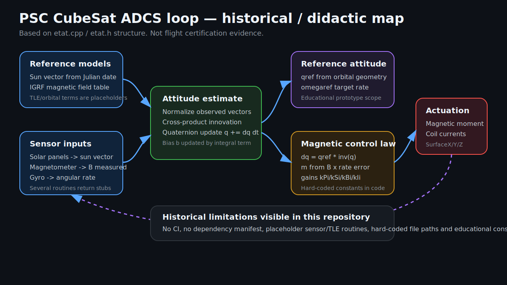
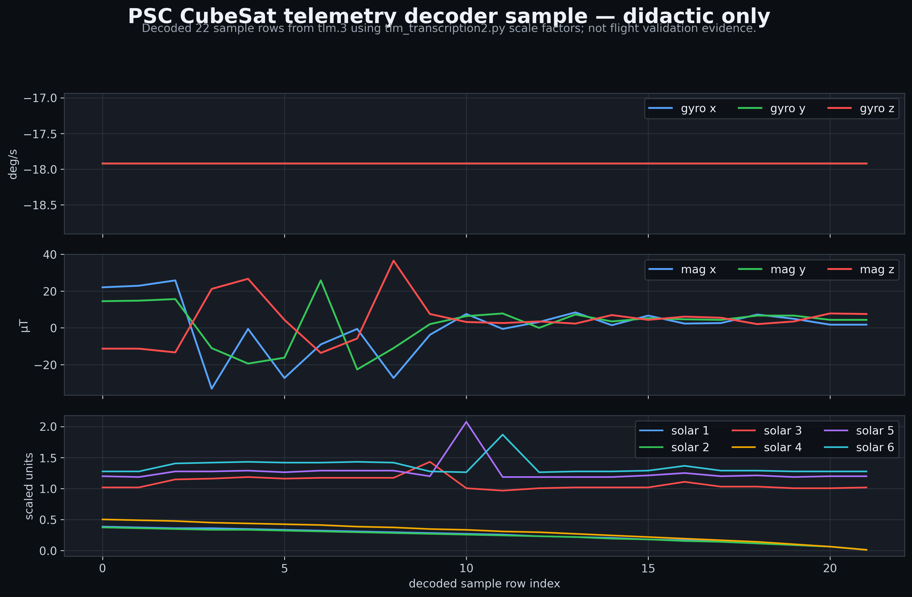

## Project #24 Preservation notice

Status: Hardware / Docs Legacy (`legacy` profile, Advisory enforcement). This repository is preserved for historical/reference value and is not presented as maintained, production-ready, secure, or suitable for new operational use.

Supersession: prefer the configured canonical origin repository or maintained libraries for new work. Canonical/provenance note: historical hardware/docs repository. Configured canonical origin: https://github.com/googa27/PSC-cubesat.git. No separate `upstream` remote is configured locally.

License/provenance: No root LICENSE detected; PDFs/DOCX/datasheets may be third-party controlled documents and need rights/provenance review before reuse.

Security/private-data warning: Hardware/spacecraft documents and scripts are advisory only; do not use for flight, operations, command generation, or safety-critical work without formal engineering review. Do not add mission-private telemetry, ground-station credentials, keys, frequencies subject to restriction, unpublished ICDs, or proprietary hardware files.

Revival gates:
- Inventory every PDF/DOCX/datasheet/script for rights, source, document revision, and hardware applicability.
- Classify telemetry/command data and exclude mission-private or controlled operational material from public fixtures.
- Add public test vectors with units, frames, endian/encoding, and authoritative expected outputs.
- Obtain formal engineering/security review before using any artifact for operations, command generation, or flight/safety-critical decisions.
- Pin compiler/interpreter dependencies and add deterministic build/check commands before claiming maintained status.

See `AGENTS.md` and `docs/ARCHITECTURE.yaml` for the advisory preservation contract.

---

# PSC-cubesat

Historical academic CubeSat repository for PSC / QB50-era attitude-determination and control-system (ADCS) experiments, telemetry decoding notes and reference documents.

This repository is preserved as a historical / didactic artifact. It is not a maintained flight-software package, not a verified operations tool and not evidence that any ADCS or telemetry routine was accepted for flight use.

## Status snapshot

| Topic | Honest current state |
| --- | --- |
| Project type | Student / academic CubeSat ADCS and telemetry workspace, circa the repository's original 2017-era context. |
| Main code | C++ prototype around `Etat` and `Quat`, plus Python translation / experiments. |
| Telemetry | Sample telemetry text files and a Python decoder for selected packet fields. |
| Documentation | Several bundled PDF / DOCX reference documents for ADCS, FIPEX, QB50 operations and telemetry decoding. |
| Verification | No CI, no dependency lockfile and no current passing build gate documented in the repo. |
| Flight claim | None. Treat code, diagrams and plots here as historical / didactic only. |

## What is in the repository?

| Path | Role |
| --- | --- |
| `main.cpp` | Minimal C++ entry point that constructs `Etat` and prints one `actualiser()` result. |
| `etat.h`, `etat.cpp` | ADCS state prototype: reference sun vector, magnetic-field lookup, sensor stubs, quaternion update, magnetic control moment and coil-current computation. |
| `quat.h`, `quat.cpp` | Small quaternion helper built on `Eigen::Vector4d`: product, inverse and vector conjugation. |
| `makefile` | Historical build attempt for the C++ files. It is not a modern portable build definition. |
| `updates.py` | Python translation / experiment for the ADCS update loop using `pyquaternion`; contains unfinished or inconsistent pieces. |
| `updates_custom.py` | Python coordinate-transform experiments for geocentric / geographic / orbital frames. |
| `tlm_transcription2.py` | Telemetry parsing helpers for selected `%...@...;...` sample lines. Converts bytes into date/time, gyro, magnetometer and solar-panel arrays. |
| `tlm.3` | Bundled historical telemetry sample credited in-file to Gérard Auvray and containing `ON0FR5>TLM` frames. Do not treat decoded plots as repo-authored flight validation evidence. |
| `trames_fipex.txt` | FIPEX-related telemetry/frame sample text. |
| `igrf.txt` | Magnetic-field table used by the historical code path, although `etat.cpp` points at a hard-coded local absolute path instead of this repo file. |
| `ADCS.pdf`, `attde.pdf`, `Rapport-ADCS-Mines-actuel.pdf` | ADCS/reference reports. |
| `FIPEX_icd_issue_2_5.pdf` | FIPEX interface-control reference document. |
| `QB50_Stratégie-dexploitation-du-satellite_V6.docx`, `Dossier-technique-du-calculateur-Cubesat-rev18.docx`, `Decodage TLM_V6.docx` | Historical operations, onboard-computer and telemetry-decoding documents. |
| `docs/assets/adcs-attitude-loop.svg` | Hand-authored didactic ADCS loop diagram grounded in the code structure. |
| `docs/assets/tlm-sensor-timeseries.png` | Didactic sample telemetry plot decoded from `tlm.3`; not flight validation evidence. |

## ADCS loop represented by the C++ prototype

[](docs/assets/adcs-attitude-loop.svg)

_Historical / didactic map based on `etat.cpp` and `etat.h`. Several sensor,
TLE and environment routines are placeholders. Visual authorship, source boundaries,
and hashes are recorded in [`docs/assets/readme_visual_provenance.json`](docs/assets/readme_visual_provenance.json)._

The loop in `Etat::actualiser()` is roughly:

1. Build reference quantities: Julian date, reference sun vector, magnetic-field lookup and orbital angles.
2. Read or stub sensor quantities: solar panels, magnetometer, gyroscope, latitude / longitude and TLE values.
3. Normalize observed and reference vectors.
4. Form a cross-product innovation from magnetic and solar-vector mismatches.
5. Update the attitude quaternion and gyro-bias estimate.
6. Compute reference attitude `qref`, attitude error `dq`, magnetic moment `m` and coil currents from equivalent coil surfaces.

Important limitations visible in code:

- `getLat()`, `getLong()`, `getOmega()`, `getTLE()` and `getChampM()` return constants or stubs.
- `etat.cpp` uses a hard-coded absolute path for `igrf.txt` rather than the repository-local file.
- The C++ make rule uses `clang -g -o file.o file.cpp` for object files, which is not a normal compile-only rule.
- The repository does not vendor or declare Eigen, `pyquaternion`, `numpy-quaternion`, NumPy or Matplotlib requirements.
- The Python translation has syntax / name issues and should be treated as exploratory notes, not a maintained port.

## Telemetry decoder sample

`tlm_transcription2.py` recognizes sample lines that split around `%`, `@` and `;`, then decodes:

- date from one field;
- time from one field;
- three gyro channels with `(byte - 2**7) * 0.14` degrees/second;
- three magnetometer channels with `(byte - 2**7) * 0.29` microtesla;
- six solar-panel channels with `byte * 12.89e-3` scaled units.

[](docs/assets/tlm-sensor-timeseries.png)

_Decoded from bundled sample file `tlm.3`, whose header credits Gérard Auvray,
using repository scale factors. This is a historical / didactic decoder
visualization, not flight validation evidence or a claim of repo authorship._

Rebuild the didactic plot without modifying the historical decoder:

```bash
uv run --with numpy==2.2.6 --with matplotlib==3.10.3 python scripts/generate_readme_telemetry_plot.py
```

## How to inspect locally

The repository has no modern environment file. A cautious local inspection path is:

```bash
# C++ compile attempt; currently expected to need dependency/build cleanup.
make

# Telemetry decoder sample; prints decoded rows from tlm.3 when NumPy/Matplotlib are available.
python3 tlm_transcription2.py
```

If you modernize this repository, start by adding a reproducible build definition, replacing the hard-coded `igrf.txt` path, separating stubs from real sensor interfaces and adding tests around quaternion algebra, coordinate transforms and telemetry parsing.

## Historical preservation notes

- Keep future README claims bounded to what this repository actually contains.
- Do not describe generated diagrams or decoded sample plots as flight logs, operational telemetry or certification evidence.
- Preserve original PDFs / DOCX files as historical references unless there is an explicit archival policy.
- Prefer small reproducible examples over broad claims about satellite performance.
